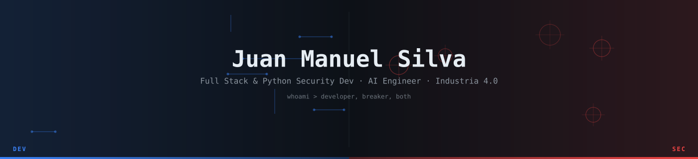

<div align="center">



[](https://jmsilva.dev)
[](https://www.linkedin.com/in/jmsilva83)
[](mailto:juanmanuelsilva06@gmail.com)
[](https://wa.me/+5493625455529)
[](https://www.instagram.com/jmsilva83)

</div>

<br>

I think about systems the way a pentester does: **what breaks first?** My work sits at the intersection of full stack development, offensive/defensive security, and applied AI — I design things security-first, whether that's a Next.js app, a Python automation, or a tool built to find the hole before someone else does.

25+ years as a certified electrician (renewable energy, industrial automation) means I read IT/OT environments differently than most software-only profiles — I've seen the physical side of the "attack surface" long before I had a name for it.

<br>

## Stack

|  |  |
|---|---|
| **Frontend** | TypeScript · React · Next.js · Astro · Tailwind · GSAP |
| **Backend** | Node.js · Python · PostgreSQL · Supabase · MongoDB |
| **Security** | Pentesting · OWASP Top 10 · Burp Suite · Nmap · Metasploit · Wireshark |
| **AI** | Claude / Gemini / OpenAI APIs, provider-agnostic by design |
| **Ops** | Git · Docker · Vercel · GitHub Actions · Linux |

```
recon → enum → exploit → post-exploit → report
```

<br>

## Security suite

Nine Python tools, offensive / defensive / forensics, each independently tested and documented — [full breakdown on my portfolio](https://jmsilva.dev/#hacker).

| | | |
|---|---|---|
| [**reconai**](https://github.com/jmsD3v/reconai) — recon orchestrator, 6 parallel agents | [**webhunter**](https://github.com/jmsD3v/webhunter) — OWASP Top 10 scanner | [**phishsim**](https://github.com/jmsD3v/phishsim) — phishing sim + AI pretexts |
| [**soclite**](https://github.com/jmsD3v/soclite) — lightweight SIEM, Sigma + ML | [**threatfeed**](https://github.com/jmsD3v/threatfeed) — multi-source CTI aggregator | [**honeygrid**](https://github.com/jmsD3v/honeygrid) — SSH+HTTP honeypot |
| [**dfirauto**](https://github.com/jmsD3v/dfirauto) — automated forensic triage | [**malwarescope**](https://github.com/jmsD3v/malwarescope) — malware analyzer, YARA-lite | [**pcapforge**](https://github.com/jmsD3v/pcapforge) — network forensics (PCAP) |

<br>

## Other work

| | |
|---|---|
| [**CvMaker**](https://github.com/jmsD3v/CvMaker) | ATS-optimized CV + cover letter generator |
| [**HEXA Servicios Integrales**](https://www.hexaservicios.com) | Corporate site — clients include Transener, Poder Judicial de la Nación, KOMSA |
| [**HEXA Gestión**](https://github.com/jmsD3v/hexa-gestion) | ERP/CRM for HEXA Servicios |
| [**ArgOS**](https://argoscyberintel.com) | Python Security Developer — Argentina's cyberintelligence/OSINT OS |

<br>

<div align="center">

<picture>
  <source media="(prefers-color-scheme: dark)" srcset="https://raw.githubusercontent.com/jmsD3v/jmsD3v/output/snake-dark.svg" />
  <source media="(prefers-color-scheme: light)" srcset="https://raw.githubusercontent.com/jmsD3v/jmsD3v/output/snake.svg" />
  
</picture>

<picture>
  <source media="(prefers-color-scheme: dark)" srcset="https://raw.githubusercontent.com/jmsD3v/jmsD3v/output/pacman-contribution-graph-dark.svg" />
  <source media="(prefers-color-scheme: light)" srcset="https://raw.githubusercontent.com/jmsD3v/jmsD3v/output/pacman-contribution-graph.svg" />
  
</picture>

<sub>Open to freelance, consulting, and security engagements · <a href="mailto:juanmanuelsilva06@gmail.com">juanmanuelsilva06@gmail.com</a></sub>

</div>
